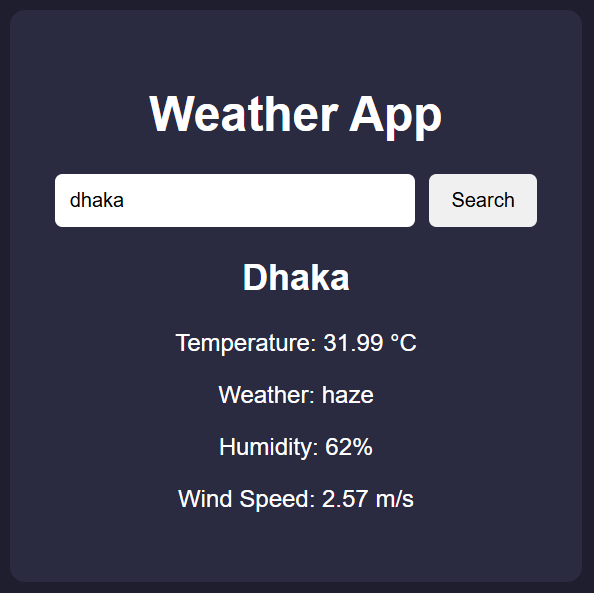

# Simple Weather App

A very simple weather app using HTML, CSS, JavaScript, and OpenWeatherMap API.

## Features

- Search weather by city
- Temperature
- Weather condition
- Humidity
- Wind speed
## Preview
>
>
>
## Live Website : [View Weather](https://imran-8.github.io/Weather_App/)

## Setup

1. Get a free API key from:
https://openweathermap.org/api

2. Open `script.js`

3. Replace:

```javascript
const apiKey = "YOUR_API_KEY";
```

with your API key.

## Run

Open `index.html` in your browser.
